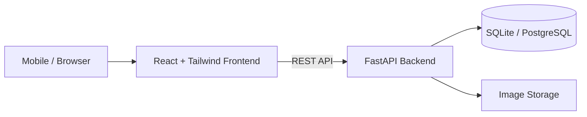
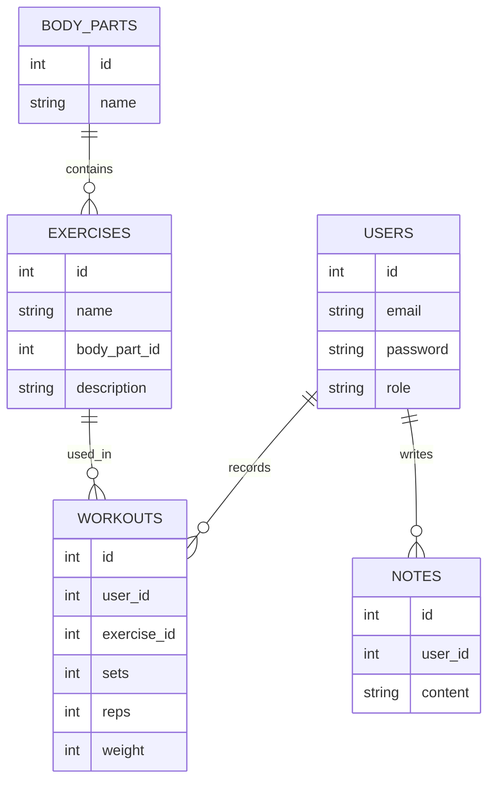

# Fitness Tracker (React + FastAPI)

A starter project for a workout tracking web app.

## Run Backend

```bash
cd backend
pip install -r requirements.txt
uvicorn app.main:app --reload
```

Backend runs at:
http://127.0.0.1:8000

API docs:
http://127.0.0.1:8000/docs

## Run Frontend

```bash
cd frontend
npm install
npm run dev
```

---

# System Architecture



---

# Database ERD


